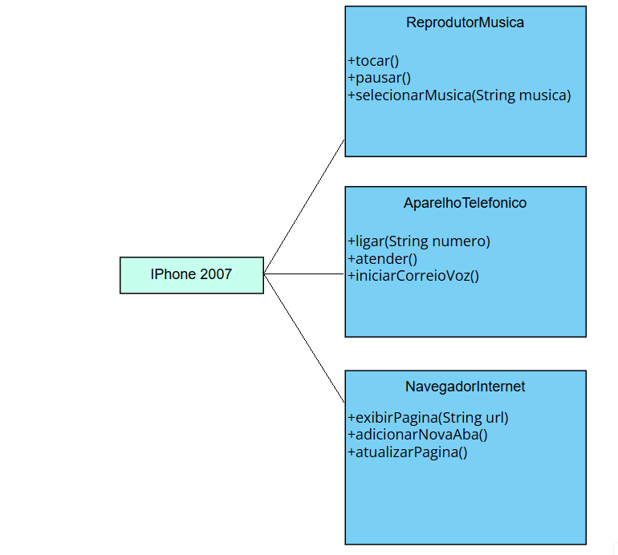

# Desafio-Iphone-2007-UML
é esse o desafio do iphone UML 2007

Um diagrama UML do iphone original e um sistema Java bem simplezinho, utilizando interfaces.

o sistema java contém um Iphone que implementa as três funções em uma classe só, na qual é instânciada na classe Main, e ocorre alguns testes nela.